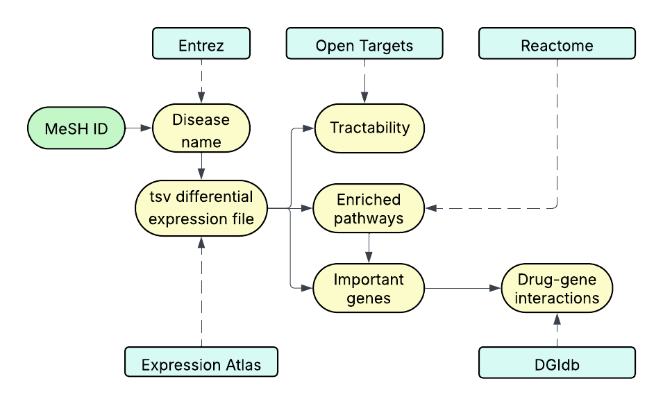

# Tractome:  a web application for integrative analysis of upregulated disease genes, pathways, and drug interactions

Tractome is a web-based application designed for the integrative analysis of disease-associated gene expression data. The tool links differentially expressed genes with tractability annotations, pathway enrichment, and drug–gene interactions, providing a comprehensive view of disease mechanisms and potential therapeutic targets. Our tool is focused on upregulated genes, which could be the target of pharmacological treatments.

## Features
- **Identify disease** using a MeSH ID.
- **Identify upregulated genes** from Expression Atlas.
- **Obtain tractability information** from OpenTargets.
- **Perform pathway enrichment analysis** using Reactome
- **Identify potential drug targets** via DGIdb.

## Why Tractome?
Tractome helps researchers quickly identify **drug-targetable genes** in complex disease datasets and understand the broader biological context, facilitating **hypothesis generation and drug discovery.**

## Getting started
1. Access the web application via [The Tractome Project at BCU](https://tractome.biocomputingunit.es).
2. Input a **MeSH ID** and upload **differential gene expression data.**
3. Explore analysis results through the web interface. 
4. Download results as needed fro downstream analysis.

## Deploying your own Tractome instance
You can also deploy your own tractome instance as such:
1. Clone this repository
2. Create a virtual environment. With venv, this would be: `python3 -m venv /desired_path/to/your/venv`
3. Activate it and install the requirements. With venv, this would be: `source /path/to/venv/bin/activate` and then `pip install -r requirements.txt`
4. Launch the server with `python3 main.py` 

Some configuration might be necessary for the Streamlit app to be available through Nginx/Apache2 proxies. Please refer to the Apache, NGINX and Streamlit documentation.